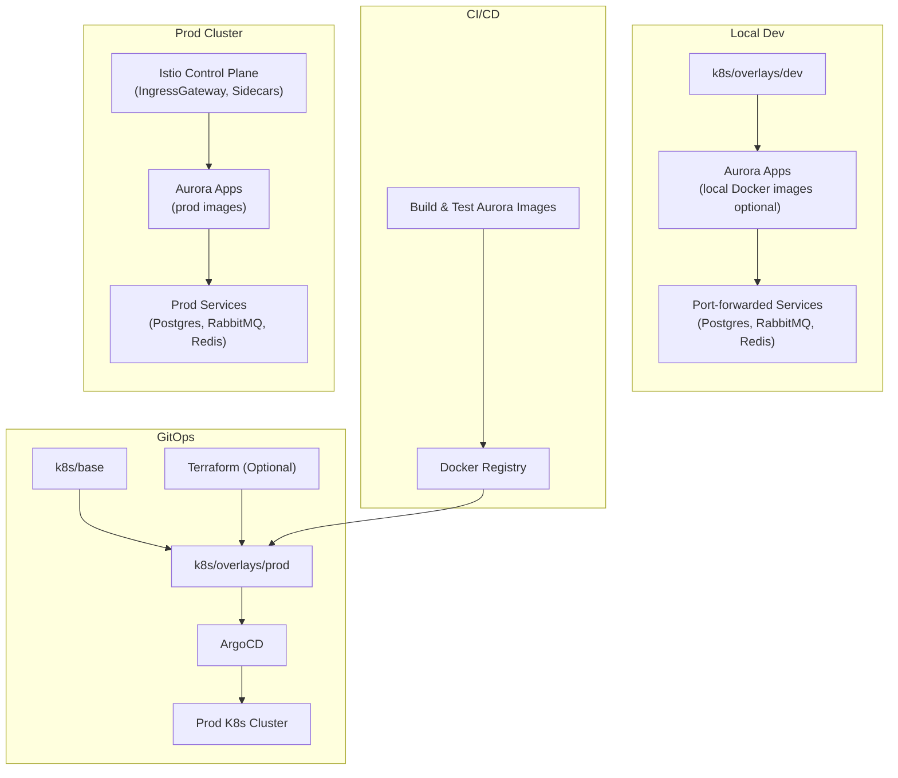

# Aurora Cloud GitOps

This repository defines the GitOps source of truth for Aurora's Kubernetes runtime, including **platform components**, **shared infrastructure dependencies**, and **application workloads**. It is designed to clearly separate **local development**, **cluster-level platform concerns**, and **production-grade application delivery**.

## Design Principles

## Diagram 


### Strict separation of concerns

* Source code repos handle **build & CI**.
* This repo handles **deployment state only**.

### Environment isolation

* `dev` → local dependency simulation, port-forward friendly.
* `prod` → real cluster services using `*.svc.cluster.local`.

### Kustomize-first

* No Helm templating logic in apps.
* Git diff = actual runtime diff.

### Istio-native

* Ingress, traffic routing, and security live in GitOps.
* Legacy API Gateway modules are removed.

---

## Repository Layout

```
aurora-gitops/
├── README.md
├── terraform/                   # Optional infra-as-code supplement
│   ├── main.tf
│   ├── variables.tf
│   └── outputs.tf
├── k8s/
│   ├── base/                     # All modules' base Kustomize configs
│   │   ├── kustomization.yaml
│   │   ├── postgres.yaml
│   │   └── rabbitmq.yaml
│   └── overlays/
│       ├── dev/                  # Local development overlay
│       │   ├── kustomization.yaml
│       │   ├── namespace.yaml
│       │   └── patch-postgres.yaml
│       └── prod/                 # Production overlay
│           ├── kustomization.yaml
│           ├── namespace.yaml
│           ├── patch-postgres.yaml
│           └── patch-rabbitmq.yaml
└── argo-applications/
    ├── dev-app.yaml              # ArgoCD Application -> dev overlay
    └── prod-app.yaml             # ArgoCD Application -> prod overlay
```

---

## How Each Layer Is Used

### `k8s/base`

* Base Kustomize manifests for apps and infra.
* Defines images, ports, and probes.

### `k8s/overlays/dev`

* Local development overlay.
* Default `application.yml` with `localhost` dependencies.
* Uses port-forwarded services only.

### `k8s/overlays/prod`

* Production overlay.
* Default `application-prod.yml` with `svc.cluster.local` service discovery.
* Deploys Aurora app images and stable backing services.

### `argo-applications/`

* Defines which overlay to sync per environment using ArgoCD.
* Example:

  * `dev-app.yaml` → dev overlay
  * `prod-app.yaml` → prod overlay

### `terraform/` (optional)

* Infrastructure provisioning for cloud or local clusters.
* Can be used to deploy namespaces, storage, or cluster components if desired.

---

## CI vs GitOps Boundary

### CI Stage

* Build images, run tests, push image tags.
* No direct cluster deployment.

### GitOps Stage

* Declare which image version to deploy in overlays.
* ArgoCD syncs clusters automatically from Git.
* Ensures **environment isolation**, **auditability**, and **rollbacks**.

---

## Minimal MVP Workflow

1. Developer starts local Aurora services (dev overlay).
2. Uses `infra/local-deps` via port-forward for dependencies.
3. CI builds Aurora images and pushes to registry.
4. GitOps repo updated with new image tags.
5. ArgoCD syncs the production cluster (prod overlay).

---

## Why This Structure Works

* Clear mental model between **build**, **deployment**, and **runtime**.
* Clean separation between **local dev** and **prod clusters**.
* Easy **Istio traffic experiments** in prod and dev.
* Git diffs reflect **actual runtime changes**, simplifying rollbacks.

---

## LICENSE

* [LICENSE](./LICENSE)